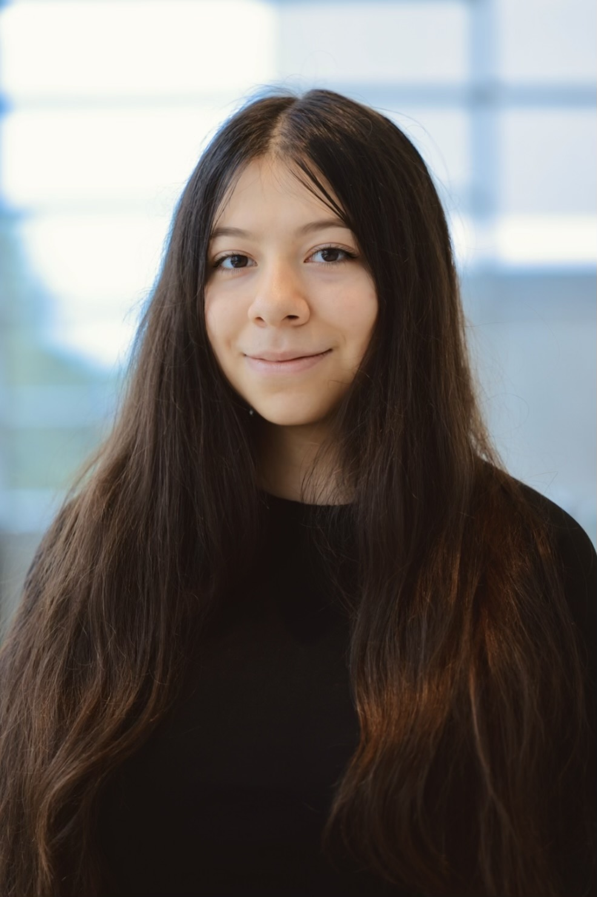
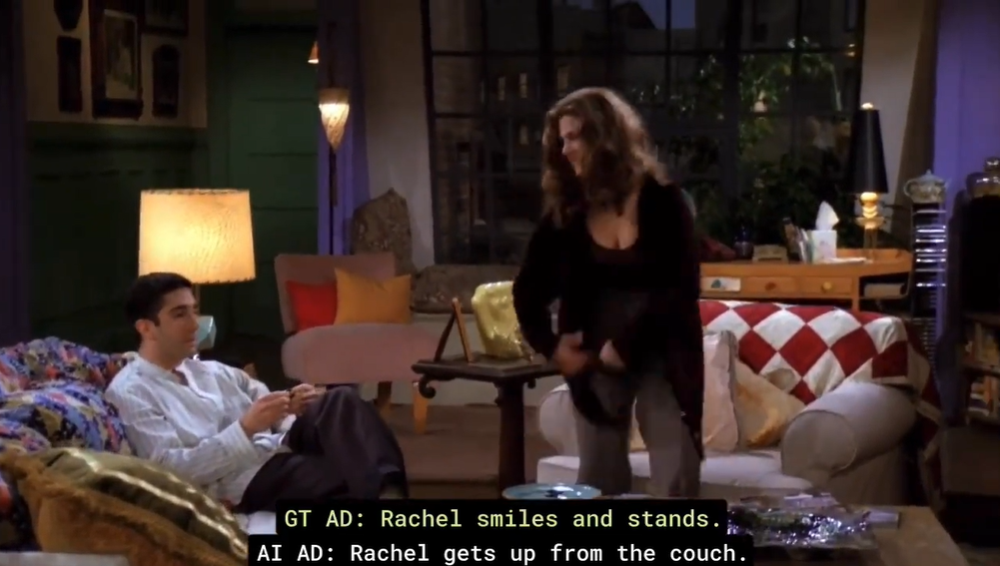
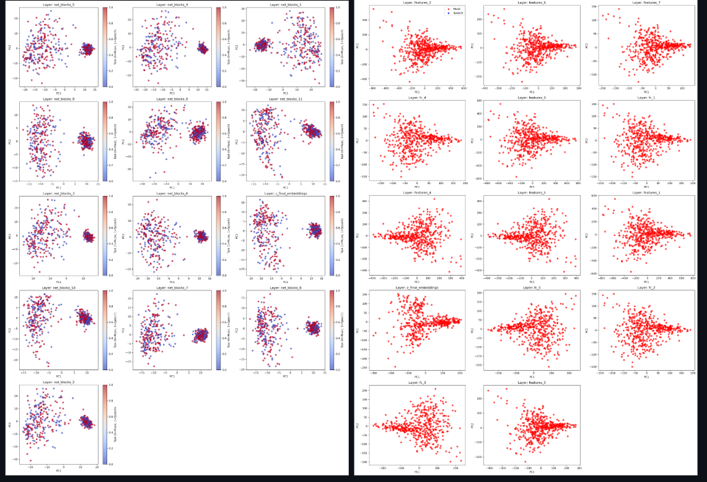
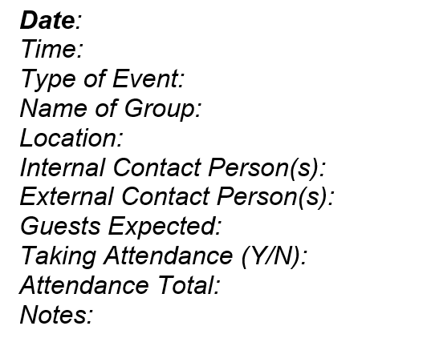

::: {.profile-header}

{width=150px style="border-radius: 50%;"}

### About

Data science student at a Northwestern University. I build data tools and models. Interested in applied ML, analytics, and automation.

[GitHub](https://github.com/mmelliem) • <a href="https://linkedin.com/in/melaniemmedina" rel="noreferrer" target="_blank">LinkedIn</a> • [Email](mailto:melaniemedina2028@u.northwestern.edu)

:::

---

## Projects

::: {.grid}

:::{.g-col-12 .g-col-md-6}

**[Audio Description Selection](projects/ad_selection.qmd)**

Using lightweight a ML model to select the best AI-generated audio descriptions for TV scenes.
:::

:::{.g-col-12 .g-col-md-6}

**[Supervised vs Self-Supervised Learning on Audio](projects/supervised_vs_ssl.qmd)**

Comparing deep neural networks on how they process speech and music classification tasks.
:::

:::{.g-col-12 .g-col-md-6}

**[Block Museum Calendar Automation](projects/block.qmd)**

Automated Outlook calendar export pipeline using Power Automate.
:::

:::

