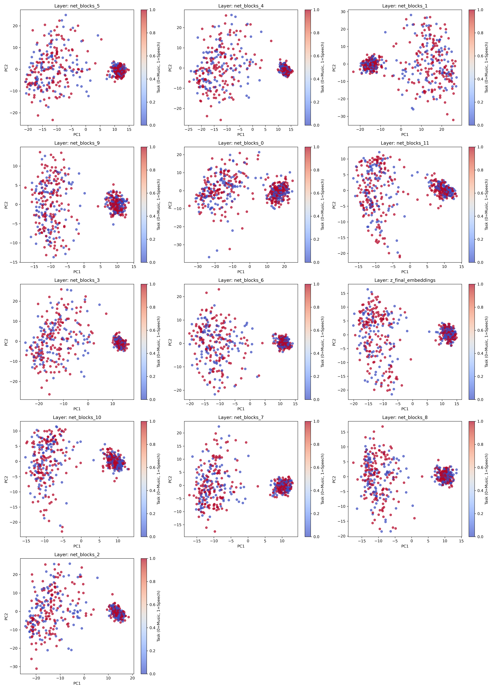
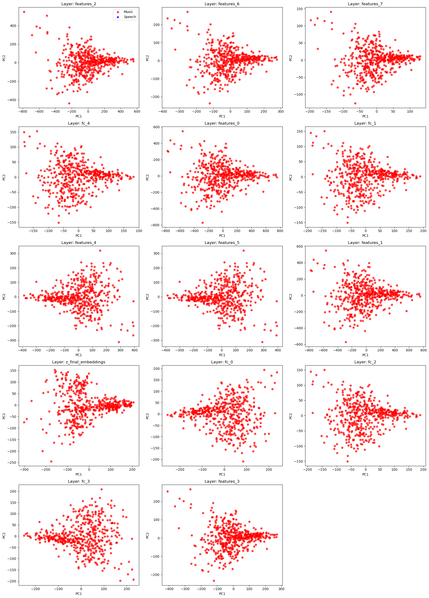
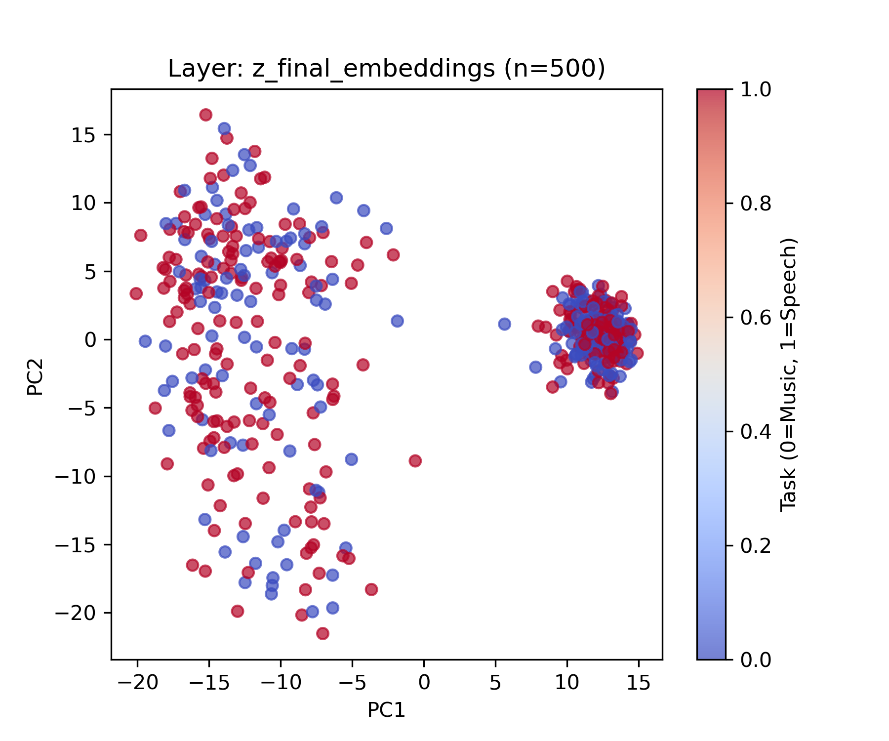
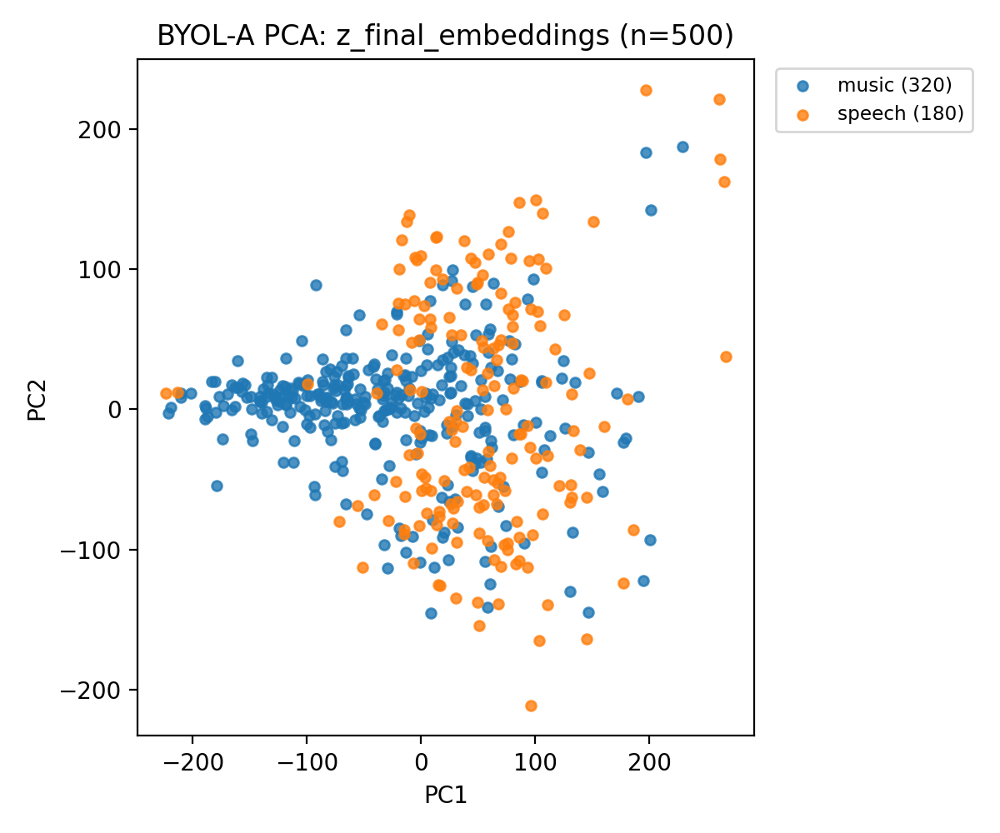

## Overview

This research project compared supervised and self-supervised machine learning approaches on music and speech classification tasks. Supervised models learn with labeled data, while self-supervised models learn with unlabeled data. The goal was to understand how deep neural networks organize information internally in their intermediate layers, and whether self-supervised models show signs of task specialization (models that show signs of processing speech/music tasks differently imitate how the brain's auditory cortex works).

## Methods

- Models: PaSST (supervised) and BYOL-A (self-supervised)
- Data: Google Speech Commands dataset, Free Music Archive, DCASE environmental noise
- Input: Log-mel spectrograms (time-frequency audio representations)
- Analysis: Extracted embeddings from final and intermediate layers (13-14 layers for each model) to visualize how models represent speech vs. music

## Findings

| Model | Architecture | Accuracy | Task Specialization |
|-------|---|----------|-----------|
| PaSST | 13 layers | ~80% | None detected |
| BYOL-A | 14 layers | ~71% | Strong in the early layers |

PaSST outperformed BYOL-A on classification accuracy. However, BYOL-A showed significant layer-wise task specialization—early layers clearly separated speech from music processing, while PaSST's intermediate layers formed no distinct clusters.

This suggests that supervised models are more prone to having a higher accuracy since they train on labeled data, while self-supervised models develop representations that may mirror brain processing. 

**Intermediate Layer Embeddings** (PCA visualization):

{width=45%} {width=45%}

*Left: PaSST | Right: BYOL-A*

**Final Layer Embeddings**:

{width=45%} {width=45%}

*Left: PaSST (unified) | Right: BYOL-A (separated)*

## Tools Used

Python • PyTorch • scikit-learn • PCA/ANOVA

## Links

For more detail on this project, read the repository README and the final report.

- [GitHub Repository](https://github.com/mmelliem/supervised-vs-SSL)
- [Research Proposal](../assets/supervised_vs_ssl/proposal.pdf)
- [Final Report](../assets/supervised_vs_ssl/final_report.pdf)

